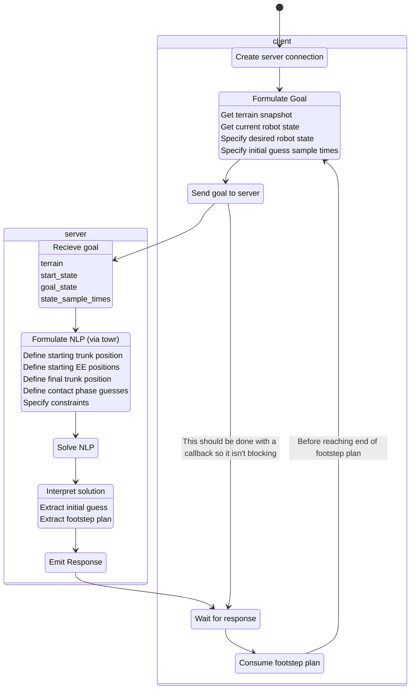

# Implementation Details

This project is build ontop of towr.

At the bottom of this document is a diagram showing the client/server interaction as well as how the server utalizes towr.

#### Implementing in your project

You'll want to write your own client into whatever you need to interface this with. [Here](https://wiki.ros.org/actionlib_tutorials/Tutorials/Writing%20a%20Callback%20Based%20Simple%20Action%20Client) is a good starting point. You'll want to be sure to use the callback functionality of ROS actions as oppsed to the blocking `waitForResult()` that was used in the example `footstep_plan_client.cc`.

#### Defining the terrain

The terrain being passed into the server is of type `convex_plane_decomposition_msgs/PlanarTerrain`. towr interfaces with terrain through a class `towr::HeightMap`. To feed the PlanarTerrain data into towr, we wrote our own implementation of the `towr::HeightMap` class, `fpowr\towr\include\towr\terrain\grid_height_map.h`. This class is mostly just a wrapper for the `convex_plane_decomposition_msgs/PlanarTerrain` code which implements the interface towr expects.

#### Extracting the footstep plan

The footstep plan is extracted in `fpowr\fpowr\include\fpowr\footstep_plan_extractor.h`. This discretizes the robot state and checks if the contact state changed at every time step. For each time the contact state changes, it looks up which convex region each foot is nearest to (or -1 if it is in the air). This forms the basis for the `towr_ros/FootstepPlan` that ultimately gets sent back to the client.

To check for the nearest convex region, `footstep_plan_extractor.h` uses `fpowr\fpowr\include\fpowr\nearest_plane_lookup.h`. This leverages `boost::geometry` to check the distances from a point to every one of the convex planes, returning the closest plane. This is not a terribly efficent approach but it was super fast to implement and has worked well for our test cases. A more efficent approach could be benefitial for enviornments with more planes or longer trajectories.

#### Extracting the initial guess

The initial guess is found using `fpowr\fpowr\include\fpowr\initial_guess_extractor.h`. This just iterates over the times specified by `float64[] state_sample_times` in the action goal and discretises the solution at every point. It would be nice to send the underlying polynomial solution, but it is currently burried in private classes, and could make interfacing more challenging for the client.

#### System diagram with example client

